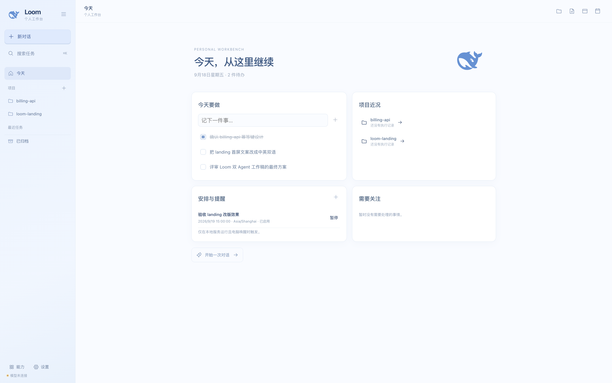
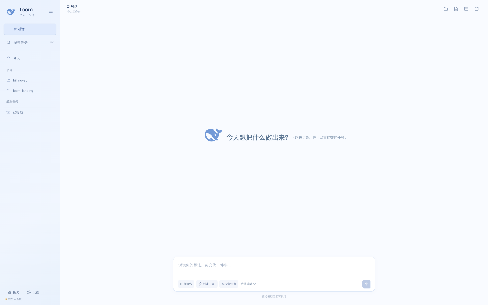
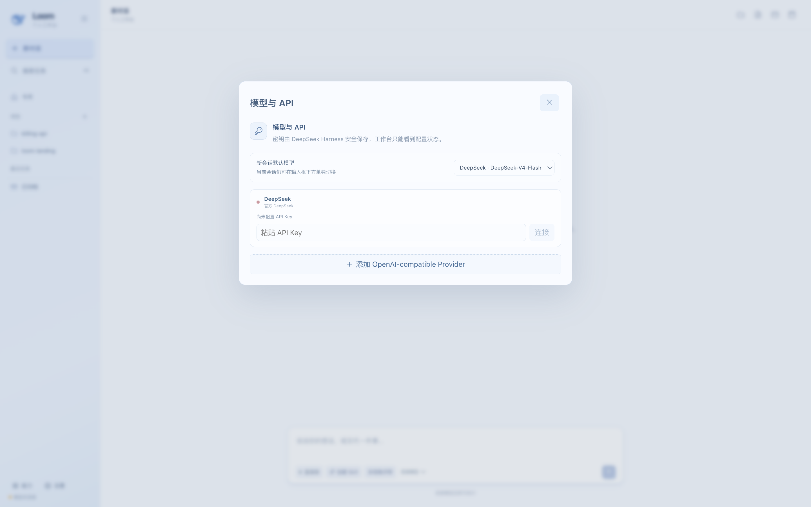
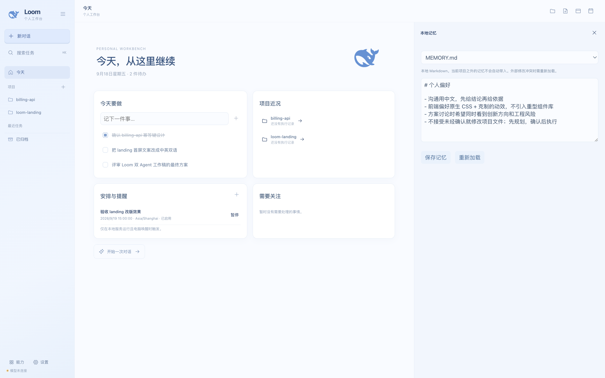
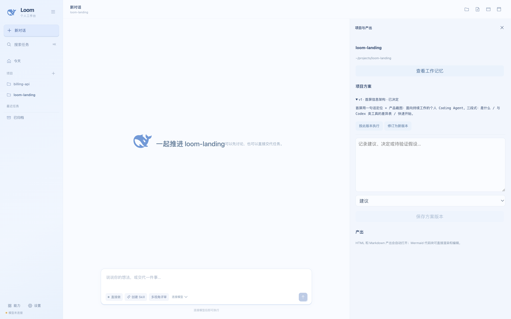

# Loom · 为「持续工作」而生的个人 Coding Agent

**今天的 Coding Agent 大多是无状态的对话执行者：每轮对话从零开始，不记得你的项目、决策和偏好；多 Agent 是无约束的派生；讨论与执行挤在一个上下文里。它们擅长一次性任务，却无法持续推进一个项目。**

**Loom 的观点恰好相反——Agent 应该是一个有记忆、有交接纪律、始终在你项目语境里工作的长期协作者。** 它在 [DeepSeek Harness](https://www.npmjs.com/package/@deepseek-ai/dsh) 原生运行时之上，只加一层"项目连续性 + 有界多 Agent 协作 + 工作管理"，把记忆、方案、评审和执行织成一张连续的工作之网（这也是名字 Loom / 织机的由来）。



- 🧠 **连续，而非重启**：个人与项目记忆是你可读可改的 Markdown，方案按版本沉淀，跨天接着干
- 🤝 **有界协作，而非无限派生**：双 Agent 评审锁死在 1 层 2 个协作者，靠一份共享工作稿强制交接
- ✅ **你始终掌握闸门**：Plan 是原生可回放的审批卡，Skill 要人工确认才安装，方案确认后才拆执行
- 🔒 **全在你电脑上**：只监听 `127.0.0.1`，密钥由 Harness 凭证系统保管，模型中立（DeepSeek / 任意 OpenAI / Anthropic 兼容服务）

> 状态：macOS 已完成真实运行验收（构建、34 项自动化测试、真实模型联调）。Windows 仅做跨平台设计，尚未真机验收，不宣称已支持。

---

## 三个断层，三个回答

**① 记忆断层。** 通用 Agent 不记得"这个项目为什么选了 A 方案""你讨厌什么风格"，每轮都要重新交代背景；有些工具把所有历史塞进上下文，既贵又不可控。
→ Loom 用人可读的 Markdown 记忆（个人 `MEMORY.md` + 项目 `overview/decisions/progress`），按问题只注入相关片段，带 sha256 修订号和写前备份；**记忆是资料，不是执行授权，也不跨项目泄漏。**

**② 协作断层。** "多 Agent"常常是无限 spawn：N 个 Agent 各说各话、上下文互相复制，最后没人能拍板。
→ Loom 是**有界双 Agent 评审**：委派深度锁死 1 层、每次最多 2 个子 Agent（插件 guard 强制，连启动失败都占名额）；创新与工程两个角色只能通过**一份带版本号的共享方案工作稿**，按 创新 → 工程评审 → 修订 → 落地 固定阶段交接。

**③ 执行断层。** 讨论记录和动手改代码混在一个长上下文里；断线、刷新后前端还可能"假完成"。
→ 你确认方案后，Loom 自动拆成 1–4 个**带依赖 DAG 的独立执行会话**，每个只拿最终决策摘要和自己的执行项；状态以 SQLite 事件溯源 + 每 5 秒真实事件对账为准，重启后绝不自动重放有副作用的任务。

---

## 产品截图

<table>
<tr>
<td width="50%" valign="top"><br><b>Today</b>：待办、项目近况、安排提醒一屏掌握——对话之外的工作台</td>
<td width="50%" valign="top"><br><b>对话即任务台</b>：先规划 / 创建 Skill / 多视角评审，三种开工方式</td>
</tr>
<tr>
<td valign="top"><br><b>模型中立</b>：官方 DeepSeek 或任意 OpenAI-compatible Provider，密钥不经过工作台</td>
<td valign="top"><br><b>本地 Markdown 记忆</b>：人可读、可编辑、带修订冲突检测</td>
</tr>
<tr>
<td colspan="2" valign="top"><br><b>项目方案版本</b>：建议 / 已决定 / 假设 / 放弃，评审结论沉淀在项目里，确认后一键拆执行</td>
</tr>
</table>

---

## 与 Codex / Cline / 裸用 Harness 的差异

| 维度 | 通用 Codex 类 Agent | Loom 的做法 |
| --- | --- | --- |
| **运行时** | 自带整套 Agent runtime | 不重造轮子：Harness 负责模型、终端、工具与 Plan Mode；Loom 只做适配与业务层，不引入第二套 Agent 运行时 |
| **Plan / Act** | 前端模拟开关，或仅靠提示词约束 | 读取 Harness **原生、可回放的 plan projection**；`exit_plan_mode` 渲染成独立审阅卡，**你不点确认就不会执行** |
| **多 Agent** | 可无限派生、上下文互相复制 | **有界双 Agent 评审**：深度锁死 1 层、每次最多 2 个子 Agent，只通过带版本号的共享工作稿按固定阶段交接 |
| **评审之后** | 讨论和执行混在一个长上下文 | 确认后自动拆成 1–4 个**带依赖 DAG 的独立执行会话**，子会话只拿决策摘要与自己的执行项 |
| **长期记忆** | 没有，或全量塞进上下文 | Markdown 记忆按问题检索注入；修订号防覆盖、写前自动备份；是资料不是授权，不跨项目注入 |
| **执行状态** | 前端乐观更新，断线易"假完成" | SQLite 事件溯源 + 每 5 秒状态对账，以真实 `turn/end` 原因为准，绝不自动重放副作用任务 |
| **Skill 扩展** | Agent 说装就装 | Skill 设计会话**没有终端和文件写入工具**，只能提问、规划、交草稿；你编辑确认后才落盘 |
| **工作管理** | 通常只有对话 | Today、待办、方案版本、定时提醒与到点自动执行（去重、DST 安全、休眠错过只通知不补跑） |
| **产出闭环** | 给个文件路径就结束 | HTML / Markdown / URL 自动进沙箱预览（独立端口 + CSP iframe），Mermaid 可直接渲染与在线编辑 |

设计中参考过 OpenAI Codex（durable events）、Cline（Plan/Act 与审批体验）和 Kit（有界子 Agent 交接）的**公开设计**，但没有复制任何源码——实现全部基于 Harness 的 API 与投影。详见 [`deepseek-harness/THIRD_PARTY.md`](deepseek-harness/THIRD_PARTY.md)。

---

## 核心工作流

### 1. 先规划，确认后再做

输入框的 **「先规划 / 直接做」** 直接切换 Harness 原生命令 `/plan`。规划完成后，原生 `plan-review` 意图渲染成审阅卡：你可以补充意见让它继续改，或点「确认方案，开始执行」。批准之前项目文件不会被动。

### 2. 多视角评审（双 Agent 共享文档）

点「多视角评审」后，主 Agent 依次拉起两个协作者：

1. **创新 Agent**：最多 3 个方向、取舍与推荐
2. **工程 Agent**：可行性、关键风险、最多 3 条修改意见
3. 原创新 Agent 吸收评审，产出修订稿
4. 原工程 Agent 写落地计划，附 1–4 个结构化执行项（读/写模式、依赖、交付物、是否需预览）
5. Loom 汇总共识与待确认项

四个章节必须按序写入同一份工作稿（服务端校验阶段顺序与修订号，字数与证据检查次数均有上限）。**你确认后**，执行项才各自创建独立会话、按依赖图推进，进度在「执行会话」面板实时可见。

### 3. 创建你自己的 Skill

「创建 Skill」进入专用 preset：Agent 先通过选择题澄清用途与边界，再提交 Markdown 草稿。草稿出现在对话里，你直接编辑、确认后才安装到 `~/LoomData/skills/<name>/SKILL.md`。

### 4. 个人连续性

- 对话里一句"明天下午提醒我验收"即可落安排；到点可自动起会话执行
- 偏好、项目决策、进展写进 Markdown 记忆，每次开工 Agent 主动读取最新版
- 换电脑：设置里导出/导入迁移包（记忆、Skills、方案、待办、安排、产出索引），**不含 API Key、凭证和原始会话**

---

## 架构

两个相邻工程，由一个启动器统一拉起（Loom 工作台 `3080` + 原生 Harness `3081` + 隔离预览 `3082`）：

| 层 | 位置 | 职责 |
| --- | --- | --- |
| 运行适配 | `deepseek-harness/server/harness.ts` | HTTP RPC、WebSocket mux 事件、选择题/审批应答、断线重连 |
| 能力装配 | `deepseek-harness/server/presets.ts` | 启动时从 Harness 标准 preset 派生出「工作」「Skill 设计」两个原生 preset，委派深度 1 层，不碰依赖包 |
| Agent 能力桥 | `deepseek-harness/server/loom-plugin.mjs` | 原生 `loom_context` / `loom_work` / `loom_skill_draft` 工具 + 子 Agent 数量 guard |
| 管理与调度 | `deepseek-harness/server/service.ts` | 上下文检索、同项目串行、唯一触发键、状态对账、评审结算、草稿确认、迁移 |
| 工作数据 | `deepseek-harness/server/store.ts` | Node 内置 SQLite（WAL）：项目/任务/运行/方案/产出/待办/安排/通知/草稿 + 事件游标 |
| 可读记忆 | `deepseek-harness/server/files.ts` | Markdown 读写、版本冲突检查、写前备份、路径越界与符号链接拦截 |
| 本地入口 | `deepseek-harness/server/main.ts` | 同源 HTTP、静态托管、SSE 事件恢复、业务接口、预览服务器 |
| 工作台 | `deepseek-harness-ui/src/Workbench.jsx` | Today、会话、确认卡、协作者、方案工作稿、记忆与预览面板 |

关键安全设计：本地服务仅绑定回环地址，校验 Host / Origin / `sec-fetch-site` 与工作台请求标识；Agent 插件回调内部接口需 Bearer token；预览服务只允许 GET，HTML 响应带 `frame-ancestors` CSP。

```text
浏览器 (React, SSE)
   │  /api/* 同源代理（白名单 RPC）
   ▼
Loom 服务 :3080 ──HTTP RPC / WS mux──▶ 原生 Harness :3081（模型·终端·工具）
   │                                       │
   ├─ SQLite (~/LoomData/state)           └─ loom-bridge 插件（带 guard）
   ├─ Markdown 记忆/Skills/产出
   └─ 预览服务 :3082（沙箱 iframe）
```

## 快速开始

需要 **Node.js 24+**（使用了内置 `node:sqlite`）。

```sh
# 1. 安装两个工程的依赖
cd deepseek-harness-ui
npm ci

cd ../deepseek-harness
npm ci

# 2. 启动（会自动构建相邻 UI，再并行拉起 Harness 与本地服务）
npm start
```

打开 <http://127.0.0.1:3080>，首次使用在「设置 → 模型与 API」连接 DeepSeek 或其他 OpenAI-compatible Provider，然后在侧栏添加一个项目文件夹即可开工。

API Key 只写入 Harness 本地凭证系统（默认 `~/.dsh`），不要提交到版本库。

### 环境变量

| 变量 | 默认值 | 说明 |
| --- | --- | --- |
| `LOOM_DATA_DIR` | `~/LoomData` | 工作数据、记忆、Skills、产出 |
| `DSH_HOME` | `~/.dsh` | Harness 配置与凭证 |
| `LOOM_PORT` | `3080` | 工作台端口 |
| `LOOM_HARNESS_PORT` | `3081` | 原生 Harness 端口 |

```text
~/LoomData/
  state/loom.sqlite          工作数据与事件流
  memory/MEMORY.md            可直接编辑的个人偏好
  memory/projects/<id>/       overview.md / decisions.md / progress.md
  memory/.history/            写前自动备份
  skills/<name>/SKILL.md      已确认安装的能力
  artifacts/                  个人产出
```

## 验证

```sh
# 后端：22 项测试 + 类型检查
cd deepseek-harness
npm test
npm run typecheck

# 前端：构建 + 12 项测试（含 Sites 部署契约）
cd ../deepseek-harness-ui
npm run build
npm test
```

README 中的产品截图来自隔离的本地演示实例（示例项目与演示数据），不涉及真实项目与凭证。

## 边界与已知限制

- **单机单用户**：这是本地工作台，不是多用户安全隔离系统；工作 preset 保留本地代码执行能力。
- **调度只在电脑唤醒、服务运行时生效**：关机/休眠期间错过超过 2 分钟的执行只通知、不自动补跑，避免重放副作用；可在界面手动运行。
- **独立评审的"不写文件"是 Agent 指令约束**，并非专用只读执行器；Skill 草稿会话则在工具层面确实没有终端和写文件能力。
- 迁移包不包含原始 Harness 会话历史，新设备不能恢复旧会话执行现场；项目文件请通过 Git 自行同步。
- Windows 尚未真机验收。

## 致谢与许可

- [DeepSeek Harness](https://www.npmjs.com/package/@deepseek-ai/dsh)：MIT，作为 npm 依赖随其自身许可分发，Loom 不修改其文件。
- React / Vite / Mermaid 等依赖保留各自许可。
- 架构分层曾参考 odt/team-agent 的思路；Codex、Cline、Kit 仅作公开设计参考，均无源码复制。完整来源与许可边界见 [`deepseek-harness/THIRD_PARTY.md`](deepseek-harness/THIRD_PARTY.md)。
